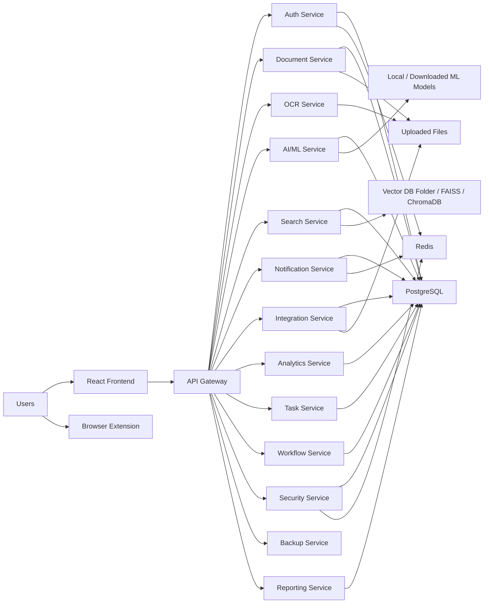
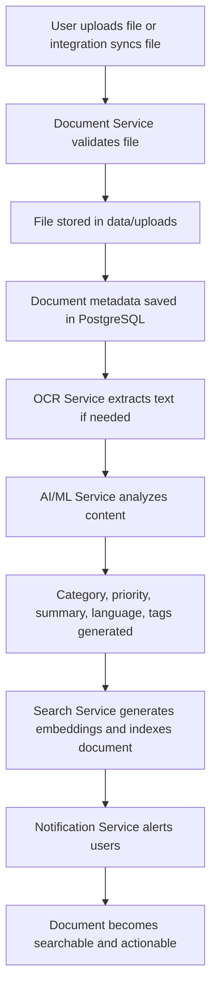
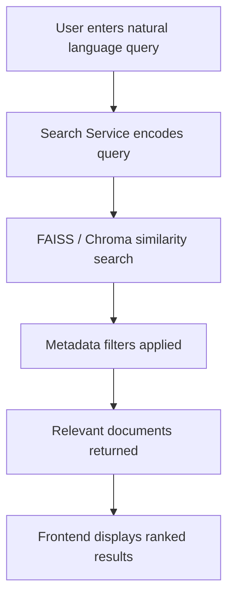
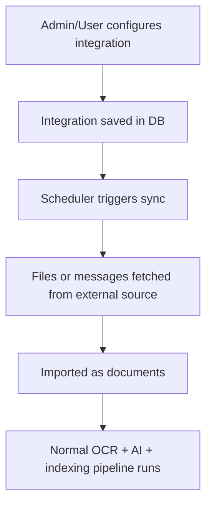
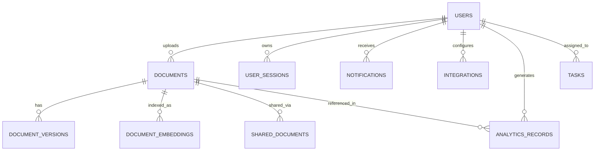

# MetroMind AI DMS

MetroMind is an AI-powered Document Management System built for high-volume enterprise and public-sector document operations. The project combines document upload, OCR, AI analysis, semantic search, integrations, notifications, analytics, and workflow-style collaboration in one platform.

This README is written so that you can explain the whole project in an interview just by reading it once.

## 1. Elevator Pitch

MetroMind solves a common operational problem: organizations receive thousands of documents from email, portals, scans, shared drives, and manual uploads, but those files are usually hard to classify, search, secure, and act on.

This system turns raw files into searchable, structured, role-controlled knowledge:

- upload or auto-collect documents
- extract text using OCR
- classify and prioritize content
- generate embeddings for semantic search
- notify the right users in real time
- manage tasks, versions, reports, and workflows around those documents

## 2. Problem Statement

Traditional document systems usually fail in one or more of these areas:

- scanned files are not searchable
- cross-language or multilingual documents are difficult to process
- finding the right document depends on exact keywords
- approvals and follow-up actions are disconnected from the document itself
- external systems like email, SharePoint, or Google Drive are siloed
- auditability and access control are weak

MetroMind addresses these gaps with an AI-first, service-oriented design.

## 3. What The Project Does

### Core capabilities

- secure authentication with JWT and role-based access control
- upload and manage documents across multiple file types
- OCR and text extraction for scanned files and images
- AI-based document analysis, classification, tagging, and summarization
- semantic search using embeddings with FAISS and ChromaDB support
- real-time notifications using WebSockets
- external integrations for email, SharePoint, Google Drive, webhook-style sources, and more
- analytics, audit visibility, backup, security, and workflow support

### Business use cases

- metro rail or government office document operations
- compliance and audit-heavy teams
- engineering, maintenance, finance, HR, and legal document handling
- search across large archives of PDFs, scans, reports, and mixed formats

## 4. High-Level Architecture

MetroMind follows a modular microservice-style architecture inside a single repository. Services are independently structured FastAPI apps, while the frontend is a separate React TypeScript application.



## 5. Service Map

The repository contains multiple backend services. The most central ones are:

| Service | Main responsibility | Typical port in code/docs |
| --- | --- | --- |
| API Gateway | entry point and request routing | `8000` or configurable |
| Auth Service | login, registration, JWT, RBAC, session logic | `8005` / configurable |
| Document Service | upload, metadata, sharing, versions, storage | `8003` / configurable |
| OCR Service | OCR and image/document text extraction | `8001` / configurable |
| AI/ML Service | classification, summarization, embeddings, analysis | `8004` / configurable |
| Search Service | semantic search and indexing | `8007` / configurable |
| Notification Service | in-app and WebSocket notifications | `8006` / configurable |
| Integration Service | external connectors and synchronization | `8008` / configurable |
| Analytics Service | usage and operational analytics | `8018` / configurable |
| Task Service | task tracking linked to documents | `8020` in config family |
| Workflow Service | templates, reviews, versioned workflow actions | `8023` in config family |
| Security Service | 2FA, sessions, security events | `8025` in config family |
| Reporting Service | report templates and generated reports | `8026` in config family |
| Backup Service | backup and restore operations | `8024` in config family |

Important note: some ports differ between `start_complete_system.py` and `config.py`, so the best way to present this in an interview is: the system uses configurable service ports, and some local startup scripts reflect earlier orchestration stages.

## 6. Frontend Architecture

The frontend is a React + TypeScript dashboard application.

### Main frontend patterns

- React Router for navigation
- React Query for server-state fetching and caching
- Material UI for component system
- Context providers for auth, notifications, toast messages, theme, and WebSocket state
- protected routes for role-based pages

### Key frontend modules

- dashboard
- documents
- shared documents
- auto-collected documents
- tasks
- search
- analytics
- integrations
- AI dashboards
- security, audit, backup, user management

## 7. End-to-End Workflow

### Document processing workflow



### Search workflow



### Integration workflow



## 8. Database Design

The backend uses SQLAlchemy models on top of PostgreSQL. The schema is broad because the platform handles identity, documents, integrations, analytics, sharing, workflow, and security in one place.

### Core entities you should mention in an interview

- `users`
- `role_permissions`
- `user_sessions`
- `documents`
- `document_versions`
- `shared_documents`
- `document_embeddings`
- `notifications`
- `integrations`
- `integration_sync_logs`
- `analytics_records`
- `audit_logs`
- `tasks`
- workflow-related entities
- reporting-related entities

### Schema relationship snapshot



### Why this schema design works

- normalized enough for operational consistency
- flexible JSON fields for integration configs and metadata
- UUID-heavy identifiers fit distributed services well
- role and permission tables support extensible RBAC
- document versions and shared documents support collaboration features

## 9. Tech Stack And Why It Is Used

### Backend

| Technology | Why it is used |
| --- | --- |
| FastAPI | fast async APIs, automatic docs, clean service boundaries |
| SQLAlchemy | ORM-based schema management and query modeling |
| PostgreSQL | reliable relational storage for users, documents, workflow, audit, analytics |
| Redis | sessions, caching, pub/sub style realtime support |
| Pydantic | request/response validation |
| Uvicorn | ASGI app serving |

### AI / ML / Search

| Technology | Why it is used |
| --- | --- |
| Tesseract / EasyOCR / OpenCV | OCR and document image preprocessing |
| Transformers | NLP tasks such as analysis and summarization |
| Sentence Transformers | document and query embeddings |
| FAISS | fast vector similarity search |
| ChromaDB | persistent vector collection option |
| spaCy / langdetect / NLTK | NLP utilities, language detection, text processing |

### Frontend

| Technology | Why it is used |
| --- | --- |
| React | component-driven dashboard UI |
| TypeScript | safer frontend code and better maintainability |
| Material UI | faster enterprise UI development |
| React Query | caching and async data fetching |
| React Router | protected page navigation |
| Socket.io client / WebSocket context | real-time notification experience |

### DevOps / Ops

| Technology | Why it is used |
| --- | --- |
| Docker | service packaging and environment consistency |
| Nginx | reverse proxy and web serving |
| Prometheus | metrics collection |
| Grafana | dashboards and observability |

## 10. Security Architecture

Security is a major talking point for this project.

### Implemented security ideas in the repo

- JWT-based authentication
- password hashing with bcrypt
- role-based access control
- session tracking
- audit logging
- optional 2FA flows in the security service
- validation with Pydantic
- permission-based access checks in service code

### Interview explanation

If asked about security, say:

1. authentication is centralized with JWT and session awareness
2. authorization is role and permission driven, not just route driven
3. sensitive actions are auditable
4. security features are separated into dedicated services so they can evolve independently

## 11. Search And AI Pipeline

This is one of the strongest parts to explain in an interview.

### Pipeline summary

1. a document is uploaded or synced from an external source
2. OCR extracts machine-readable text if the file is scanned or image-based
3. AI analysis identifies category, language, priority, and summary
4. embeddings are generated from content
5. embeddings are stored and indexed
6. user queries are embedded and matched semantically
7. ranked documents are returned with previews and metadata

### Why semantic search matters

Keyword search only works when the user knows the exact phrase. Semantic search helps when:

- the user describes meaning instead of exact wording
- documents use synonyms
- files come from different departments with inconsistent naming
- multilingual content appears in the same dataset

## 12. Integrations Story

MetroMind is not only an upload portal. It is designed as a document intake platform.

### Integration categories visible in the codebase

- email and IMAP-style inbox ingestion
- SharePoint
- Google Drive
- webhook-based ingestion
- Dropbox-style or file-source extensions
- communication and enterprise tool placeholders

### Why integrations matter

- reduce manual upload effort
- bring documents from systems users already work in
- make MetroMind the central searchable layer across tools

## 13. Folder Structure

```text
metromind-ai-dms/
├── browser-extension/   # extension UI and scripts
├── data/                # uploads, templates, generated artifacts
├── docker/              # Docker and nginx config
├── frontend/            # React TypeScript frontend
├── models/              # model registry and related assets
├── scripts/             # utility and admin scripts
├── services/            # FastAPI backend services
├── tests/               # backend, frontend, extension, e2e tests
├── utils/               # shared helpers like logging and email
├── vector_db/           # vector index persistence
├── config.py            # centralized configuration
├── database.py          # SQLAlchemy models and DB setup
└── start_complete_system.py
```

## 14. Key Engineering Decisions

### Why microservices-style separation?

- better modularity
- easier ownership of domains like auth, documents, search, notifications
- easier scaling of heavy services like OCR and AI
- cleaner future deployment path

### Why PostgreSQL plus vector search instead of only one database?

- transactional business data fits PostgreSQL
- vector similarity search needs specialized indexing behavior
- hybrid design keeps both structured and semantic workloads efficient

### Why React dashboard for frontend?

- many admin-style modules
- fast iteration for enterprise UI
- strong ecosystem for tables, charts, forms, and role-based screens

## 15. Strengths Of The Project

- broad real-world scope: documents, AI, integrations, workflows, security
- strong backend domain coverage
- practical enterprise features, not just a demo upload screen
- good interview value because it covers architecture, data, AI, and UX together
- codebase shows both product thinking and systems thinking

## 16. Honest Gaps / Improvement Areas

This section is useful in interviews because it shows engineering maturity.

- some documentation files overstate or drift from the current repository structure
- some startup scripts and configured ports are inconsistent
- API gateway implementation appears partially in transition compared with other services
- some modules look more production-ready than others
- there is room to standardize orchestration, environment setup, and API contracts

If an interviewer asks about this, say:

"The project is functionally broad, and one of the engineering lessons was that as the platform expanded, documentation and orchestration needed consolidation. A next step would be standardizing deployment, service discovery, and cross-service contracts."

## 17. How To Run The Project

Because the repo contains multiple scripts and evolving service orchestration, the safest local entry points are:

### Backend dependencies

```bash
pip install -r requirements.txt
```

### Frontend dependencies

```bash
cd frontend
npm install
```

### Start the system

```bash
python start_complete_system.py
```

Alternative scripts also exist, such as:

- `python start_services.py`
- `bash start_all.sh`

### Frontend only

```bash
cd frontend
npm start
```

## 18. Interview Questions And Strong Answers

### 1. What problem does this project solve?

It converts raw, scattered, and often non-searchable documents into a structured, searchable, secure knowledge system with AI-assisted processing and workflow support.

### 2. Why did you choose microservices?

Different domains like OCR, authentication, notifications, and search have different scaling and operational needs. Splitting them reduces coupling and makes the system easier to evolve.

### 3. Why use OCR here?

A large portion of enterprise documents are scans, images, or PDFs without selectable text. OCR makes them machine-readable so search, analytics, and AI can work.

### 4. Why use semantic search instead of keyword search?

Semantic search improves discovery when wording differs between the query and the document. It is especially useful for large archives and inconsistent file naming.

### 5. Why PostgreSQL if you already have a vector database?

PostgreSQL stores transactional and relational business data well. Vector search solves a different problem: similarity matching over embeddings. They complement each other.

### 6. How do you handle security?

JWT authentication, bcrypt password hashing, role-based permissions, audit logs, session tracking, and an extended security service for 2FA and session governance.

### 7. How does the upload pipeline work?

Upload -> validate -> store file -> persist metadata -> OCR -> AI analysis -> embedding generation -> vector indexing -> notify users -> expose for search and workflow.

### 8. How does the system scale?

Heavy workloads like OCR and AI can be scaled independently from auth or reporting. The architecture also supports future queue-based processing and container-based deployment.

### 9. What was the hardest engineering part?

Coordinating document lifecycle stages across services: file storage, OCR, AI enrichment, indexing, permissions, notifications, and user-facing status updates.

### 10. What would you improve next?

- unify service orchestration
- standardize ports and environment handling
- strengthen contract testing between services
- improve deployment automation
- formalize background job processing with queues/workers

## 19. Short Interview Summary

If you need a 30-second explanation, use this:

"MetroMind is an AI-powered document management system built with FastAPI microservices, PostgreSQL, Redis, React, OCR, and vector search. It takes documents from uploads and external integrations, extracts and analyzes content, indexes it for semantic search, secures access with RBAC, and supports notifications, tasks, analytics, and workflow features for enterprise-scale operations."

## 20. Final Takeaway

MetroMind is not just a CRUD document app. It is a full platform that combines:

- document lifecycle management
- AI enrichment
- semantic retrieval
- enterprise security
- collaboration and workflow support
- cross-system integrations

That combination is exactly what makes it a strong project to present in interviews.
